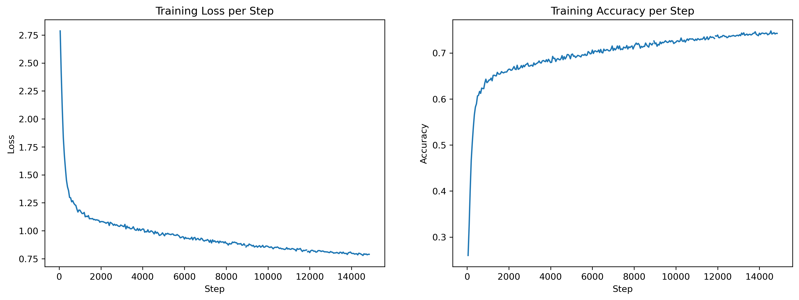

# Character-level Text Generation on Harry Potter Books

## Introduction

A boredom project of mine, heavily inspired by [Andrej Karpathy's video](https://www.youtube.com/watch?v=kCc8FmEb1nY&t=2156s).
This is a character-level Transformer model trained on the Harry Potter books. The aim of the project for me personally is to try to remember how to use PyTorch and Lightning, and to try to understand the Transformer model better.

## Dataset

The dataset is taken from [Formcept's Github Repo](https://github.com/formcept/whiteboard/tree/master/nbviewer/notebooks/data/harrypotter). I combined them together to create a single text file of all the books. The data isn't necessarily "clean" as it still contains titles and also page numberings. 

Obviously, the dataset is not big enough to train a good model, but it is good enough for me to try out some things. Also, don't sue me J.K. Rowling.

## Training

I trained it on Kaggle's two T4 GPUs for 5 epochs (well can train for longer, but 30 hours GPU time allocation kept me grounded) and it took about roughly 10 hours. I used a batch-size of 512 and AdamW optimizer with a learning rate of 1e-3. Other notable hyperparameters choice are the maximum context length (block size) of 32, embedding size of 512, 8 layers, 16 heads, and a dropout rate of 0.1. The training loss and accuracy per step is shown below.



## Results

The model is able to learn the structure of the book and the names of the characters. However, it is not able to learn the names of the spells and the places. I think this is because the dataset is too small and the model is not able to learn the context of the spells and the places. Here are some examples of the model's output (text enclosed in stars are the prompt):

### Example 1

```text
*Harry, y'er a wizard!*” 

She drew out a hand to shoot backward into it, she looked as if 
someone had killed him then?” whispered Harry, 
shaking uncontrollably. 

“Give it a rest, Hermione,” said Tonks, and you are worried, are 
you?” 

“No,” Mr. Weasley muttered. “Well, it ought to be qualified for,” 
before turning back to the Dursleys’ 
house. There was no longer a pay 
raise power, won’t they?” said Hermione curtly. 
“There’s an easier way up at the cat, the small window 
started to spin yet again a little to 
listen to her. He stared guilty at the 
World Cup.
```

### Example 2

```text
*Ron, you are a good friend*. 

“Hagrid, do you think we’d have to 
change,” said Bill, who was dead. “Just a funny 
Parseltongue, a man with whom he could never have achieved 
```

### Example 3

```text
*James Potter is a filthy man*, Harry, they are now 
in Diagon Alley much longer! You shall have no hope of releasing Gryffindor. 

“Upstairs, come back!” shouted 
Hagrid after Umbridge, because what had happened the door, waving ahead and 
allowed himself to smash away when he saw it: a patch of 
broke open and revealed a head of the 
syllabus.” 

Angelina gave Fred an appraising sense of 
security prisoners in this subject, everyone knows that 
Dumbledore had got left the room.
```

## Conclusion and Future Work

It's not good, but I won't say it's the worst thing in the world either. I think the model is able to learn the structure of the book and the names of the characters because they are repeated often enough. It's generated text are somewhat coherent and it is able to generate some interesting sentences.

However, I find that the model cannot really capture long-term dependencies well enough (probably due to the context length). I also think the dataset is too small and the model is not able to learn the context a lot more nuances about the world. Also in general, more training time and more data would probably help, better hyperparameter tuning would also help.
